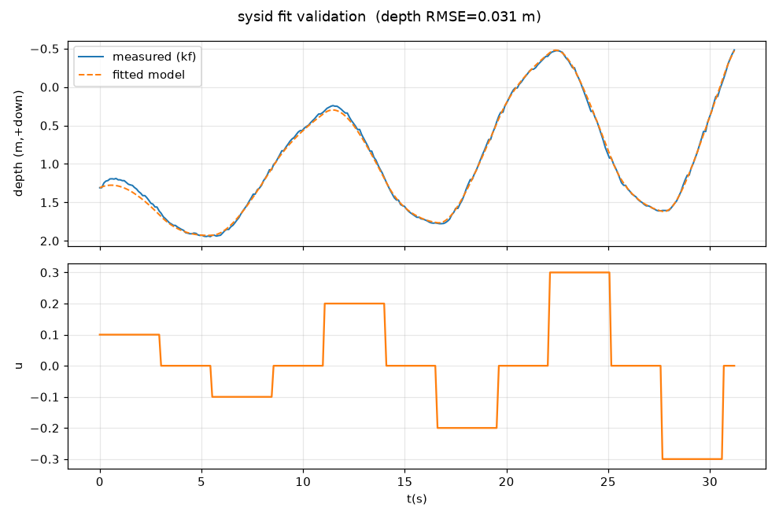

# P3 — 系统辨识框架(已在 SITL 验证,待真机数据)

从开环阶跃响应辨识深度动力学模型,回填 `config/depth_model.yaml` 的 `identified` 段,
供 MPC(P5)使用真实模型。**需入水采集**(出水台架无深度变化)。

## 工具
- `src/sysid_collect.py` — 开环采集:依次发恒定 u(默认 ±0.1/±0.2/±0.3),每个保持数秒、
  其间回中位,记录 (t, u, depth) 到 CSV。复用解锁/安全/退出自动上锁/深度软限位。
- `src/sysid_fit.py` — **仿真误差最小化**拟合(scipy least_squares):以参数仿真深度轨迹
  去逼近实测深度(**只用深度、不对噪声微分**,鲁棒)。给出拟合优度 + 回放验证图,
  `--write` 回填 `identified` 段。

## 模型与可辨识性
```
w_dot = (K·u + net_buoy − c_lin·w − c_quad·w|w|) / eff_mass
```
只有比值可辨识(eff_mass 与力项同尺度耦合),故拟合归一化系数
`b_u=K/m, b0=net_buoy/m, a_lin=c_lin/m, a_quad=c_quad/m`,再固定 `eff_mass=标称值`反算。
动力学只依赖比值,不影响 MPC/plant 预测。

## SITL 验证(已知真值 → 检验流水线)
用 SITL(sim_truth: K=80, net_buoy=−2, c_lin=5.2, c_quad=37, m=26)采集 ±0.1/±0.2/±0.3 阶跃并拟合:

| 量 | 真值 | 拟合 |
|---|---|---|
| b_u=K/m | 3.08 | 2.61 |
| b0=net_buoy/m | −0.077 | −0.068 |
| net_buoy(反算) | −2.0 | −1.78 |
| **深度回放 R²** | — | **0.998** |
| **深度回放 RMSE** | — | **0.031 m** |



- **模型能把深度轨迹复现到 ~3 cm**(这是 MPC 需要的);b_u 略低、c_lin/c_quad 线性↔二次
  拆分有偏,是数据量有限时二者难分离所致,可用更长/更丰富的激励改善。
- 流水线(采集→拟合→回放验证→写回→MPC 自动切换 identified)端到端跑通。

## 真机流程(明天/入水后)
```powershell
# 1. 入水、确认安全,采集(会解锁)
python -m src.sysid_collect --steps "0.1,-0.1,0.2,-0.2,0.3,-0.3" --hold 4 --settle 4 --arm --label pool1
# 2. 拟合 + 看回放验证图(先不写)
python -m src.sysid_fit data\sysid_pool1.csv
# 3. 满意后写回 identified 段(MPC 将优先使用真实模型)
python -m src.sysid_fit data\sysid_pool1.csv --write
# 4. 用真实模型重跑 P5 对比
python -m src.depth_control --controller mpc ... 
```
> 待真机后可能需要:更丰富的激励(不同幅值/正弦扫频)、固定 eff_mass 的标称值(可由 CAD+附加质量估计)、必要时改进拆分线性/二次阻尼。
