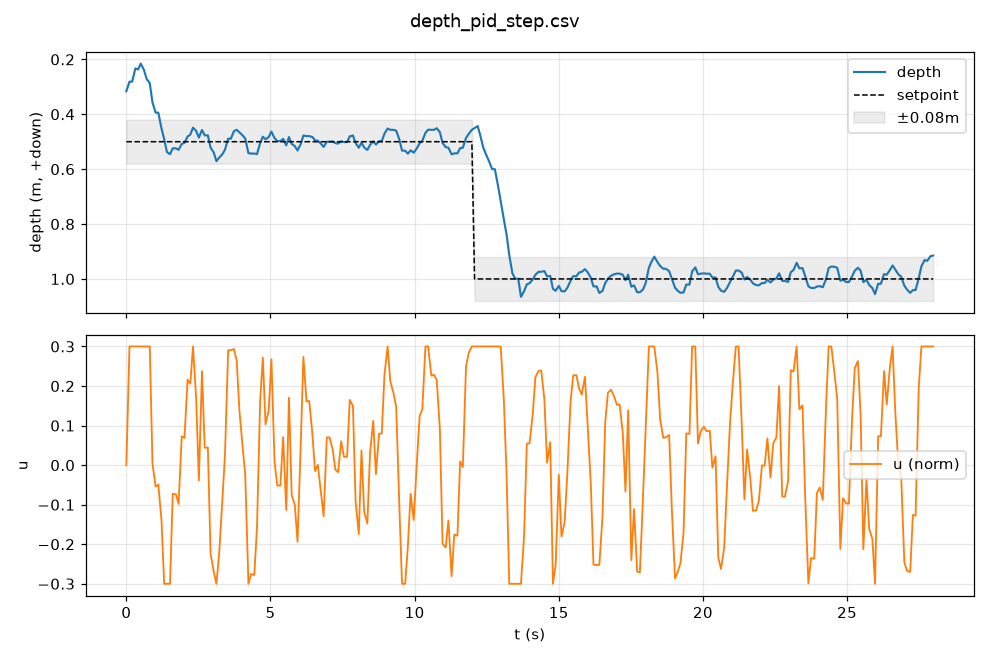
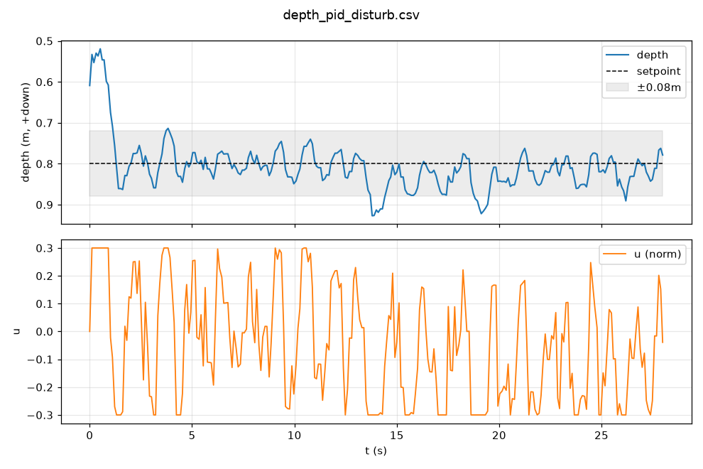

# P4 结果 — PID 定深基线(SITL)

在软件在环仿真(`tests/sim_vehicle.py`,深度动力学真值 + 0.02 m 高斯噪声)上,用外环 PID
闭环控制深度,作为 MPC(P5)的对比基线。控制器/框架:`src/depth_control.py` + `src/pid.py` + `src/state.py`(2 阶卡尔曼)。

## 控制器参数(`config/vehicle.yaml` 的 `pid` 段)
- `Kp=3.0, Ki=0.5, Kd=1.0`,`i_limit=0.3`,`u_limit=0.3`(归一化,`U_MAX=0.3`)。
- 控制频率 `CTRL_HZ=10`;微分作用于测量(depth_rate),含饱和条件积分抗饱和。

## 实验一:阶跃响应(0.5 → 1.0 m @ t=12s)


| 指标 | 值 |
|---|---|
| 上升时间(10–90%) | 1.02 s |
| 超调 | 11.9 % |
| 调节时间(±0.10 m) | 1.19 s |
| 稳态 RMSE | 0.037 m(≈测量噪声量级) |
| 控制能量 ∑u²dt | 1.04 |

## 实验二:抗扰(定深 0.8 m,注入 12 N 恒定向下扰动)


| 指标 | 值 |
|---|---|
| 峰值偏移 max_dev | 0.127 m |
| 恢复(回到目标附近) | 积分项产生稳态 u≈−0.14 持续抵消扰动 |
| 控制能量 ∑u²dt | 1.13 |

> 说明:`settle_time` / `recovery_time` 用"最后一次离开窄带"的定义,在测量噪声下偏保守;
> 稳态性能以 `rmse_ss`(3.7 cm)与峰值偏移为准。

## 结论
- PID 能稳定定深:上升 ~1 s、超调 ~12%、稳态误差落在噪声量级;对 12 N 恒定扰动峰值偏移 ~13 cm 并由积分项完全抵消。
- 这是 **P5 MPC 的对比基线**:MPC 目标是在**超调 / 抗扰峰值偏移 / 控制能量**至少一项上显著优于本基线,且不违反约束。

## 复现
```powershell
# 阶跃
python tests\sim_vehicle.py --seconds 45 --cmd-timeout 30 --depth-noise 0.02 --z0 0.5   # 终端A
python -m src.depth_control --controller pid --d1 0.5 --d2 1.0 --t-step 12 --seconds 28 --arm --yes --label step  # 终端B
python tests\analyze_depth.py data\depth_pid_step.csv --t-step 12 --target 1.0 --band 0.08
# 抗扰
python tests\sim_vehicle.py --seconds 45 --cmd-timeout 30 --depth-noise 0.02 --z0 0.8 --disturb-force 12 --disturb-at 16 --disturb-dur 100
python -m src.depth_control --controller pid --d1 0.8 --d2 0.8 --t-step 999 --seconds 28 --arm --yes --label disturb
python tests\analyze_depth.py data\depth_pid_disturb.csv --detect-disturb --target 0.8 --band 0.08
```
