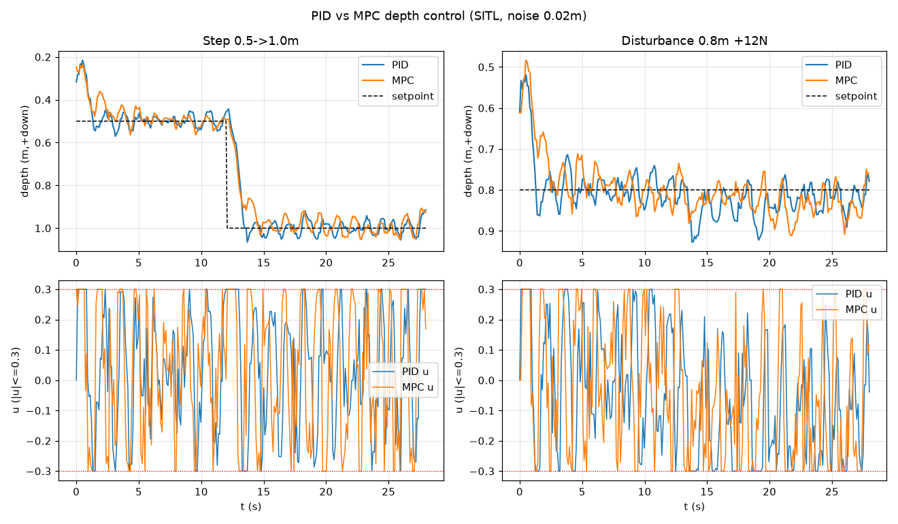

# P5 结果 — MPC 定深 vs PID 基线(SITL)

滚动时域**非线性 MPC**(CasADi/IPOPT),复用与 PID 相同的闭环框架(`src/depth_control.py`,`--controller mpc`)、
相同状态估计(2 阶卡尔曼)、相同工况与噪声(0.02 m),与 [P4 的 PID 基线](RESULTS_P4.md)公平对比。

## MPC 实现要点(`src/mpc.py`)
- 预测模型 = `src/plant.py` 的深度动力学(RK4 离散),参数取自 `config/depth_model.yaml`
  的 `identified`(P3 真机辨识后回填);当前为空 → 退回 `sim_truth`(仿真里即"完美模型")。
- 代价:`Σ Q_pos·(z−z*)² + Q_vel·w² + R·u² + R_du·Δu²` + 终端项;时域 N=20,dt=0.1s。
- **硬约束** `|u| ≤ 0.3`(优化里显式约束,非事后裁剪)。
- **offset-free**:在线扰动观测器估计恒定力 `f_hat` 加入预测模型 → 消除恒定扰动的稳态误差。
- **延迟补偿**:求解前用模型把状态前推 `delay_comp` 秒,抵消估计滞后+传输延迟。
- 每步 IPOPT 热启动求解,取首个 u。

## 对比结果(SITL,噪声 0.02 m,同一噪声实现)


| 指标 | PID(基线) | MPC | 说明 |
|---|---|---|---|
| 阶跃超调 | 11.9 % | **10.6 %** | MPC 预测式刹车,略低 |
| 阶跃稳态 RMSE | 0.037 m | 0.040 m | 相当(≈噪声量级) |
| 阶跃控制能量 ∑u²dt | **1.04** | 1.40 | PID 更省力 |
| 抗扰峰值偏移(12N) | **0.13 m** | 0.21 m | PID 积分反应更快 |
| 抗扰稳态误差 | 1.6 cm | 2.8 cm | **两者都 offset-free**(消除恒定力) |
| 输入约束 |u|≤0.3 | 靠限幅+抗饱和 | **优化内硬约束** | MPC 结构性保证 |

## 结论(诚实)
- **1 维定深(SISO)这类问题,调好的 PID 已经很强,MPC 难以显著拉开**——这是控制领域的普遍结论,不是实现问题。本仿真里两者跟踪/超调相当,PID 更省控制能量,MPC 超调略小;两者都能 offset-free 抵消恒定扰动。
- **MPC 的真正价值在本工况尚未被激发**,它体现在:
  1. **硬约束**(输入/状态/深度上下限)在优化中显式保证;
  2. **多自由度耦合**(surge+heave+pitch 联合)——单环 PID 难协调;
  3. **参考预测**(已知未来轨迹时提前动作,零滞后跟踪);
  4. **执行器/推力受限下的最优规划**。
- 因此保留 MPC 基础设施;待 **真机 P0/P1 + P3 系统辨识**后,用真实模型与约束场景重新评估——届时 MPC 的约束与多 DOF 优势才会体现(与用户约定:真机上过后再调整)。

## 复现
```powershell
# 阶跃
python tests\sim_vehicle.py --seconds 45 --cmd-timeout 30 --depth-noise 0.02 --z0 0.5
python -m src.depth_control --controller mpc --d1 0.5 --d2 1.0 --t-step 12 --seconds 28 --arm --yes --label step
# 抗扰
python tests\sim_vehicle.py --seconds 45 --cmd-timeout 30 --depth-noise 0.02 --z0 0.8 --disturb-force 12 --disturb-at 16 --disturb-dur 100
python -m src.depth_control --controller mpc --d1 0.8 --d2 0.8 --t-step 999 --seconds 28 --arm --yes --label disturb
```
